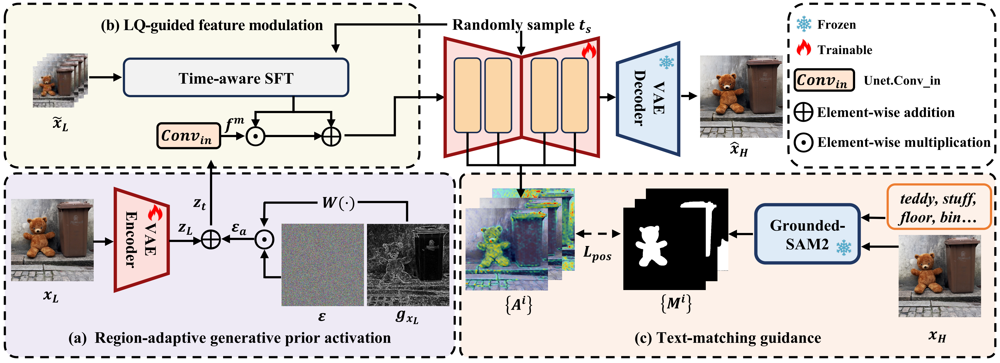

### (CVPR 2026) Bridging Fidelity-Reality with Controllable One-Step Diffusion for Image Super-Resolution

> [[Paper](https://arxiv.org/abs/2512.14061)] &emsp; [Supplemental Material] &emsp;

> Hao Chen, [Junyang Chen](https://jychen9811.github.io/), [Jinshan Pan](https://jspan.github.io/), [Jiangxin Dong](https://scholar.google.com/citations?user=ruebFVEAAAAJ&hl=zh-CN&oi=ao)<br>
> [IMAG Lab](https://imag-njust.net/), Nanjing University of Science and Technology

> If CODSR is helpful for you, please help star the GitHub Repo. Thanks!

> Welcome to visit our website (专注底层视觉领域的信息服务平台) for low-level vision: [https://lowlevelcv.com/](https://lowlevelcv.com/)

---

<p align="center">
  
</p>

*An overview of our CODSR. (a) The region-adaptive generative prior activation method introduces gradient-driven adaptive noise to achieve the region-aware activation of generative priors. (b) The LQ-guided feature modulation module exploits the uncompressed LQ information to modulate the diffusion process for restoring faithful structural details. (c) The text-matching guidance strategy harnesses the region maps generated by Grounded-SAM2, which correspond to the textual descriptions, to constrain the text–image interaction regions within the cross-attention layers, thereby enabling effective textual guidance during generation.*

### 🚩 **New Features/Updates**
- ✅ March 24, 2026. Our testing code and pre-trained model are now available!
- ✅ February 21, 2026. Our CODSR was accepted by **CVPR 2026**!
- ✅ December 14, 2025. Release CODSR [paper](https://arxiv.org/abs/2512.14061).

### ⚡ **To do**
- Release the training code.
- Release the Gradio Demo and ComfyUI Integration.

## 🔧 Dependencies and Installation

Clone repo
```bash
git clone https://github.com/Chanson94/CODSR.git
cd CODSR
```

 Install dependent packages
```bash
conda create -n CODSR python=3.10 -y
conda activate CODSR
pip install --upgrade pip
pip install -r requirements.txt
```

Download Models 
* [CODSR Pre-trained Model](https://drive.google.com/drive/folders/1-A22c4bFs_ShvoVXRTqDNb4wjaLw8Du1)
* [SD21 Base](https://huggingface.co/stabilityai/stable-diffusion-2-1-base)
* [RAM](https://huggingface.co/spaces/xinyu1205/recognize-anything/blob/main/ram_swin_large_14m.pth)
* DAPE
* Put them in the `./preset/models` folder and update the corresponding path in test.sh

## ⚡ Quick Inference
```
sh test.sh
```

## 🚀 Calculate Inference Time
For easy comparison, we provide the inference time testing script for CODSR.
```
sh test_inference_time.sh
```
## 📏 Benchmark Results
For convenient comparison, we upload the benchmark results to [Google Drive](https://drive.google.com/drive/folders/1G8K8wunvkYgfNrEVqXJ__KvsppKSfp_A). These benchmarks were directly copied from [StableSR](https://huggingface.co/datasets/Iceclear/StableSR-TestSets?row=0) and [SUPIR](https://github.com/Fanghua-Yu/SUPIR?tab=readme-ov-file). Additionally, we also provide a script for testing IQA (Image Quality Assessment).
```
sh metrics.sh
```

### Citation

If this work is helpful for your research, please consider citing the following BibTeX entry.
```
@inproceedings{codsr,
  title={Bridging Fidelity-Reality with Controllable One-Step Diffusion for Image Super-Resolution},
  author={Chen, Hao and Chen, Junyang and Pan, Jinshan and Dong, Jiangxin},
  booktitle={CVPR},
  year={2026}
}
```

### Contact
If you have any questions, please feel free to reach us out at <a href="mailto:chenhao_jxpyy@njust.edu.cn">chenhao_jxpyy@njust.edu.cn</a>.

### Acknowledgments
Our project is based on [OSEDiff](https://github.com/cswry/OSEDiff), [CoMat](https://github.com/CaraJ7/CoMat) and [Grounded SAM2](https://github.com/IDEA-Research/Grounded-SAM-2). Thanks for their awesome works.